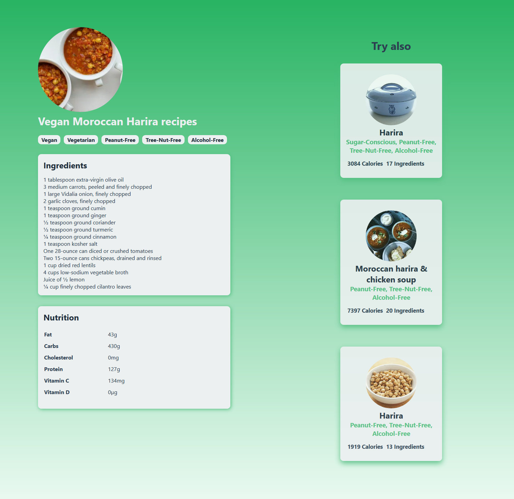

## 🌱 Foody - Food Recipe App

This blog is built using Nextjs, And is still in progress.

## ✅ Demo

## ✅ Install 
- Clone the project.
- Then run `yarn` to install the dependecies.
- get an API key from **www.edamam.com**, 
- Create a DOTENV file and add the API kEY to it `ADAMAM_API_KEY=your-api-key`
- After that run `yarn dev` to run the app in 
**development mode**.
- Open [http://localhost:3000](http://localhost:3000) to view it in the browser.
